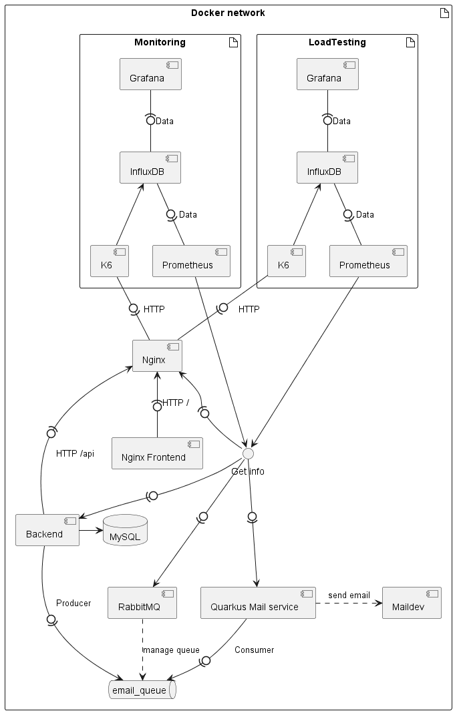

# Doc-AL

## Project architecture
At first we will present you our software structure 

The application has two main components: 
* the front-end which is served by a static file server and the back-end which is managed by a NestJS service. 
* The back-end service interacts with a MySQL database to store data, uses an AMQP message queue to send messages in an asynchronous manner, and provides metrics to Prometheus.
* Additionally, there's a Quarkus Microservice which receives messages from the AMQP queue and sends emails through the SMTP protocol and also expose metrics to Prometheus. 
* Nginx is used to route incoming requests as a reverse proxy and load balancer to the relevant internal service. 
* The system is monitored and analyzed using Grafana, InfluxDB, Prometheus, and load tested using K6. This system also uses rabbitmq as message queue for communication between NestJS and Quarkus Microservice.

For the Backend and Frontend the technologies were fixed. You can see that our service under "big" indeed we had no time to decompose into micro service our 
frontend and backend. In order to facilitate our advancement in the tp we have decided to keep a fairly large granularity on our services.

For sending mail we used rabbitmq for sending data instantly and Quarkus for the mail service. However, we will see later that we did not succeed in making this module work.

We minimize the number of ports used with nginx. Nginx is utilized as a reverse proxy and load balancer in the system, it's a web server that known for its efficient resource utilization and capability to handle a high number of simultaneous connections, which makes it suitable for use in a microservices architecture as a reverse proxy and load balancer.

For monitoring we used Grafana, Prometheus and InfluxDB which are simple solutions to set up with docker for our use. We also used K6 for load testing.

## Service

| Service | Description | Port | Status (proposed, design, implemented, load tested, validated) |
| --- | --- | --- | --- |
| adminer | Database management | 8080 | implemented |
| MySQL | Database | 3306 | implemented|
| BACK | Backend | 8081 | load tested |
| FRONT | Frontend | 8082 | load tested |
| RabbitMQ | Message broker | 5672 | implemented  |
| Quarkus | Mail service | 8083 | implemented  |
| ngnix | Load balancer | 80 | load tested |
| Grafana | Monitoring | 3000 | implemented |
| Prometheus | Monitoring unifier | 9090 | implemented  |
| InfluxDB | Monitoring | 8086 | implemented |
| K6 | Load testing | 3001 | implemented |
| meldev | Mail service | 8084 | design |

## Problems during the project 

1. Connection problem between the backend and the database [Solved] -> Big waste of project time
2. Connection problem between the backend and the frontend [half  Solved] (need to use chromium on linux ???!) -> waste of project time
3. Cannot send mail with Quarkus [ Open ]
4. Grafana Problemes with datasources plugins internals errors.
  Cant load the datasource when querying in the graphs 
5. Grafana Problemes with influxDB connection.
