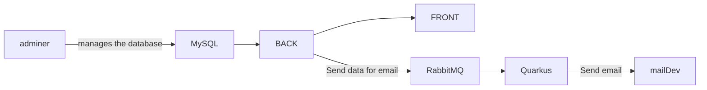

# Doc-AL

## Project architecture

You can see above our architecture that we use. You can see that our service under "big" indeed we had no time to decompose into micro service our 
frontend and backend. In order to facilitate our advancement in the tp we have decided to keep a fairly large granularity on our services.

You can also see above that we have set up rabbitMQ in order to notify a quarkus service which in turn can send mail to a meldev module.

## Service
implemented :
- [X] adminer
- [X] MySQL
- [X] BACK
- [X] FRONT
- [X] RabbitMQ
- [ ] Quarkus
- [ ] ngnix
- [ ] load testing module

## Problems during the project 

1. Connection problem between the backend and the database [Solved] -> Big waste of project time
2. Connection problem between the backend and the frontend [Solved] (need to use chromium on linux ???!) -> waste of project time
3. Problem sending data to the rabbitmq queue [Solved] -> waste of project time
4. Problem sending email with Quarkus [
